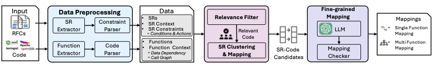

# Spec2Code
This is the achive of Spec2Code: Automated Mapping of Software Specification to Code
Implementation via Large Language Models




## Data
`data/repos` 4 repos rawdata and extracted funcs

`data/results` 4 repos mapping results and inconsistency cases

`data/benchmark` benchmark info

`data/rfc` rfc documents and extracted specifications

## Code
`code/scripts` code of mapping

### New (refactored) workflow code

This repo now also includes a **minimal runnable, paper-aligned workflow** under `code/rfcflow/`:

- RFC text → SR extraction
- Source code → functions (+ optional clang-based dependencies)
- filter1 → dual-filter → extract-constraints → pre-verify → final-verify

Install:

```bash
pip install -r code/rfcflow/requirements.txt
```

Quickstart (TLS + BoringSSL):

```bash
export OPENAI_API_KEY=...
python code/rfcflow/run.py extract-sr --rfc-id 8446 --out-dir /tmp/rfcflow_out
python code/rfcflow/run.py extract-functions --project boringssl --out-dir /tmp/rfcflow_out
python code/rfcflow/run.py filter --protocol tls --out-dir /tmp/rfcflow_out
python code/rfcflow/run.py dual-filter --protocol tls --out-dir /tmp/rfcflow_out
python code/rfcflow/run.py extract-constraints --protocol tls --out-dir /tmp/rfcflow_out
python code/rfcflow/run.py pre-verify --protocol tls --out-dir /tmp/rfcflow_out
python code/rfcflow/run.py final-verify --protocol tls --out-dir /tmp/rfcflow_out
```

Notes:
- Data layout auto-detection (no extra args): RFCs from `data/rfc/rawrfc/`, code from `data/repos/<project>/rawdata` (httpd uses `rawcode`).
- For clang-based dependency extraction, set `LIBCLANG_PATH=/path/to/libclang.so` (optional but recommended).
